<!-- SEO: Senior Full-Stack Developer Dubai | React Developer UAE | Next.js Node.js TypeScript PostgreSQL AWS -->

<div align="center">

<!-- ANIMATED TECH ORBIT BANNER -->


</div>

<div align="center">

[](https://www.linkedin.com/in/ashish-kumar-maurya-fullstack/)
[](https://github.com/AshishK-M)
[](https://github.com/AshishK-M)

</div>

---

## 👋 Hi, I'm Ashish — Senior Full-Stack Developer based in Dubai, UAE

> **React · Next.js · Node.js · TypeScript · PostgreSQL · AWS**  
> Building scalable, production-ready web applications with nearly **5 years of professional experience**.

I'm a **Senior Full-Stack Developer** specializing in **React, Next.js, Node.js, TypeScript, and PostgreSQL**, with hands-on cloud experience on **AWS**. I've built and shipped real products across **fintech, e-commerce, and enterprise SaaS** — writing clean, maintainable code that scales.

Worked with global teams at companies including **PayPal** (via Quantlytix Solutions) and **Aucust**, delivering high-impact features across the full stack.

---

## 🛠️ Tech Stack & Skills

> *Senior Full Stack Developer · React Developer · Next.js Developer · Node.js Engineer · TypeScript · PostgreSQL · AWS · JavaScript · Dubai · UAE*

### 🎨 Frontend


### ⚙️ Backend


### 🗄️ Database & Cloud


---

## 💼 Professional Experience

```
🏢 PayPal (via Quantlytix Solutions)   →  Full-Stack Development · Fintech
🏢 Aucust                              →  Full-Stack Development
🏢 Wikisoft Technology                 →  Full-Stack Development
🏢 Code Unity Technology               →  Full-Stack Development
```

---

## 🚀 What I Build

- ✅ **Full-Stack Web Apps** — React + Next.js frontend · Node.js + Express backend · PostgreSQL
- ✅ **RESTful & GraphQL APIs** — Scalable, documented, production-hardened
- ✅ **Cloud-Deployed Applications** — AWS (EC2, S3, Lambda, RDS) · Docker
- ✅ **Performance-Optimized UIs** — SSR/SSG with Next.js · Core Web Vitals
- ✅ **Type-Safe Codebases** — TypeScript across the full stack

---

## 📊 GitHub Stats

<div align="center">


</div>

---

## 🌍 Open to Opportunities

- 🇦🇪 **UAE** — Dubai, Abu Dhabi (on-site / hybrid)
- 🌐 **Remote** — Global / MENA region
- 💼 **Contract & Full-Time** · Senior Full-Stack · Lead Developer roles

---

## 📫 Let's Connect

<div align="center">

[](https://www.linkedin.com/in/ashish-kumar-maurya-fullstack/)

</div>

---

<div align="center">
<sub>Senior Full-Stack Developer · React · Next.js · Node.js · TypeScript · PostgreSQL · AWS · Dubai UAE</sub>
</div>

<!-- SEO: full stack developer dubai, react developer uae, next.js developer dubai, node.js developer uae, typescript developer, postgresql developer, aws developer dubai, javascript developer uae, senior software engineer dubai, hire full stack developer uae -->
